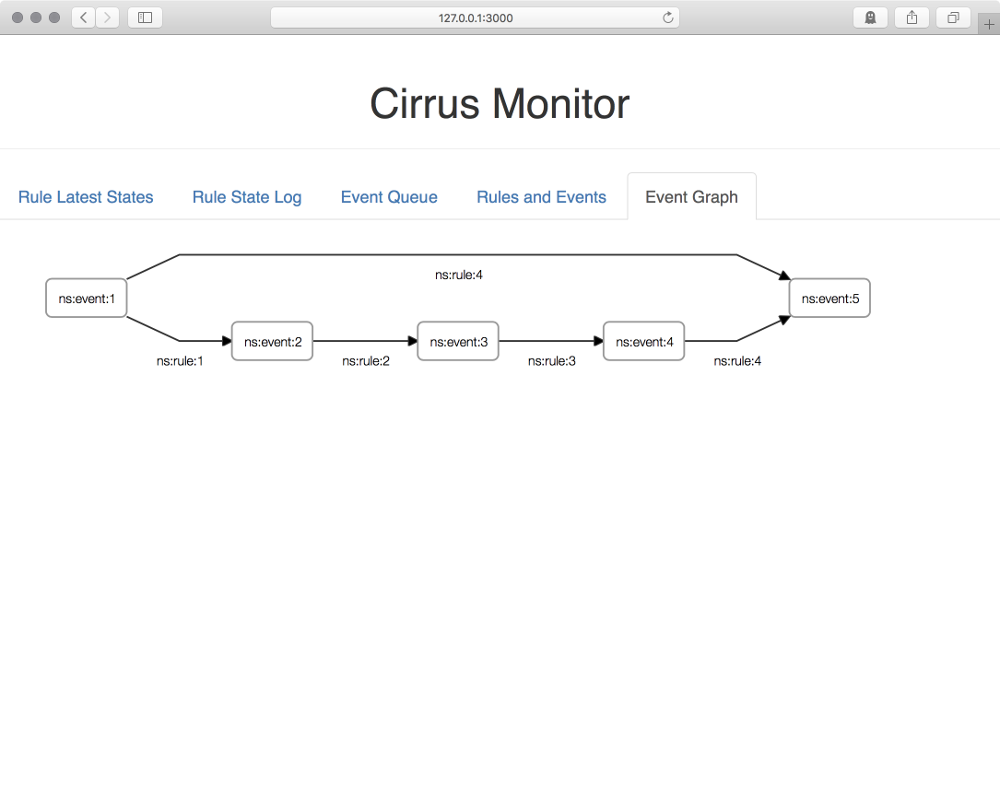

Cirrus: a very light weight event driven docker job coordinating system
=======================================================================

This is a toy project for demonstrating  coordinating job running (yet another workflow engine if you like)
with a simple event driven system. You will need to most recent Docker installation as current each task/job
is executed through a docker container. When I have time and if this work is indeed useful, I might extend 
the scope to be more general.


Just want to test it out
------------------------

On a Linux or Mac with proper Docker installation, the following commands will run a simple test:

```
git clone git@github.com:cschin/cirrus.git
cd cirrus
cd src/
bash restart-service.sh
bash run_test.sh
```

After `bash run_test.sh`, you can point your brower to `http://127.0.0.1:3000/`.
You will see the information about the "events" and "rules" as shown below:

(this is tested with Safari / Chrome, there seems to be some SVG issues with Firefox now.)

There are two main components a coordinator and a dispatcher  running a Docker server 
using Docker swarm.  The simple (directed acyclic) graph shows when a certain event set is triggered 
by sending HTTP requests to the coordinator what "rule" will be executed and a "rule" may trigger
another event set too.

Set up chain of events (OK, a workflow if you like)
---------------------------------------------------

The file `src/test/test_coordinator.py` shows how one can setup the example shown above:

A commented version shown below shows how to set up chains of events.

One thing that is important to know is the rules are triggered by an "event set" but not by
some single event. Namely, only if all events in an event set are triggered, the coordinator
will send out signal for a dispatcher to execute a rule.  For rules that can be triggered by
single event, we will still need to define an event set for the single event (it is ok with the
same name.) 
 

```
import requests
import json
from pprint import pprint

# The host name and the post to make HTTP request to the coordinator
crdURL = "http://127.0.0.1:7000"

# make 5 events in the system
events = {"ns:event:1":{},
          "ns:event:2":{},
          "ns:event:3":{},
          "ns:event:4":{},
          "ns:event:5":{}}

# make 5 event sets of each single events
event_set = { e:[e] for e in events }

# make an event set that has two events
event_set["ns:event_set:1"] = ["ns:event:1", "ns:event:4"]

# define the rules

# Each rule is a dictionary with one key-value pair.
# The key is the event to trigger the rule, the values contain some information
# about what to do when the rule is triggered. In this testing example, we 
# ask the dispatcher just to trigger some other event sets
rules = {"ns:rule:1": {
            "ns:event:1": {
              "activity": {"cmd":"__auto_trigger__"},
              "triggering": "ns:event:2",
              "attempts": 1 }},
        "ns:rule:2": {
            "ns:event:2": {
              "activity": {"cmd":"__auto_trigger__"},
              "triggering": "ns:event:3",
              "attempts": 1 }},
        "ns:rule:3": {
            "ns:event:3": {
              "activity": {"cmd":"__auto_trigger__"},
              "triggering": "ns:event:4",
              "attempts": 1 }},
        "ns:rule:4": {
            "ns:event_set:1": {
              "activity": {"cmd":"__auto_trigger__"},
              "triggering": "ns:event:5",
              "attempts": 1 }}
        }


pprint(events)
pprint(event_set)
pprint(rules)


# here we make the HTTP requests to the coordinator to register
# the events / event sets / rules

for e, payload in events.items():
    requests.put("http://127.0.0.1:7000/r/event/{}".format(e),
                  json=json.dumps(payload))

for es, payload in event_set.items():
    requests.put("http://127.0.0.1:7000/r/event_set/{}".format(es),
                  json=json.dumps(payload))

for r, payload in rules.items():
    requests.put("http://127.0.0.1:7000/r/rule/{}".format(r),
                  json=json.dumps(payload))


# a couple of example showing how to query what is setup in the system
r = requests.get("http://127.0.0.1:7000/q/queue:event")
print(r.json())

r = requests.get("http://127.0.0.1:7000/q/event")
print(r.json())

r = requests.get("http://127.0.0.1:7000/q/event_set")
print(r.json())

r = requests.get("http://127.0.0.1:7000/q/rule")
print(r.json())
```

The script `src/tests/test_trigger.py` shows how one can trigger the defined events:

```
import requests
import json
from pprint import pprint

crdURL = "http://127.0.0.1:7000"

triggers = {"ns:event:1":{"action":"trigger"},
            "ns:event:2":{"action":"trigger"},
            "ns:event:3":{"action":"trigger"},
            "ns:event:5":{"action":"trigger"}}


for e, payload in sorted(triggers.items()):
    payload["force"] = "true"
    r = requests.post("http://127.0.0.1:7000/r/event/{}".format(e),
                      json=payload)
    print(r.json())
```

Example: Running Docker containers
----------------------------------

The script `src/tests/test_docker.py` defines the excutions of the rules by running  
a docker container from the image `worker`. A `worker` does nothing but triggers some
events.

```
rules = {"ns:rule:1": {
            "ns:event:1": {
              "activity": {"cmd": '',
                           "task_type": "docker",
                           "image": "worker"},
              "triggering": "ns:event:2",
              "attempts": 1 }},
        "ns:rule:2": {
            "ns:event:2": {
              "activity": {"cmd": '',
                           "task_type": "docker",
                           "image": "worker"},
              "triggering": "ns:event:3",
              "attempts": 1 }},
        "ns:rule:3": {
            "ns:event:3": {
              "activity": {"cmd": '',
                           "task_type": "docker",
                           "image": "worker"},
              "triggering": "ns:event:4",
              "attempts": 1 }},
        "ns:rule:4": {
            "ns:event_set:1": {
              "activity": {"cmd": '',
                           "task_type": "docker",
                           "image": "worker"},
              "triggering": "ns:event:5",
              "attempts": 1 }}
        }
```

One can test it out by 
```
python tests/test_docker.py
http --json POST http://127.0.0.1:7000/r/event/ns:event:1 action=trigger force=true
```

You can monitor the docker container by `docker ps -a`.

 
What if I want to X/Y/Z?
-------------------------

This is more or less a quick hobby project. The total number of lines of code of the 
coordinator and the dispatcher is probably less than this `README.md`.  There are already many
other excellent workflow engines. You might want to take a look at some of them first. (I have
been watching various workflows engines for a number of years myself.)

I started this simple thing just to test out the concept coordinating job execution by 
using HTTP API and messaging passing with ZeroMQ. Not a totally new idea but it is fun to 
make it work by writing small amount of code.  I have been using it for some basic 
bioinformatics tasks and I am sure I can also use Cirrus to simplify more complicated thing 
like making large genome assemblies non-homogeneous environments.

If this simple engine by coordinating chain of events becomes useful for some of my other
work, I will probably gradually extend its functionalities. Or, using it as a prototype for
other event driven platforms for job coordinations.  

TODOs
-----

Many possibilites but I do have to see where this small project goes before setting particular
goals.

-----------
Jason Chin, Mar. 2018


